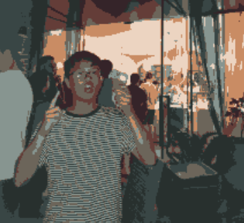
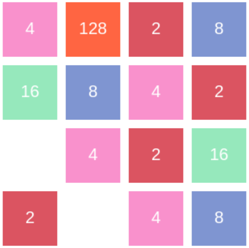
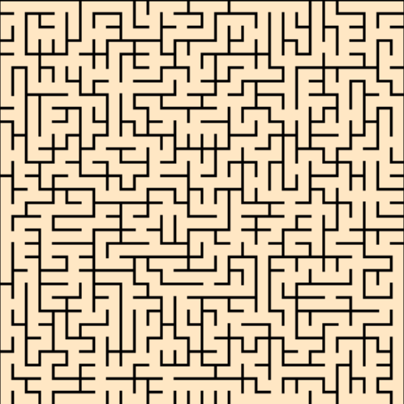
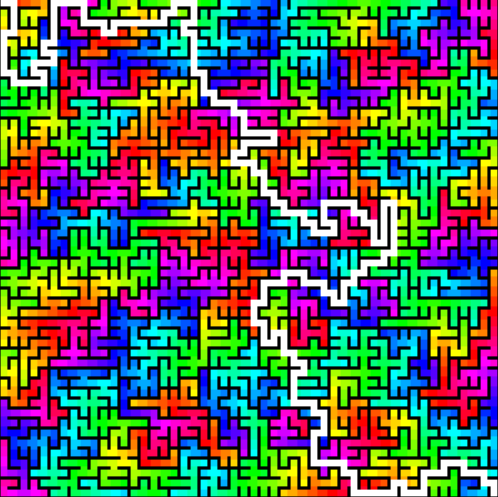
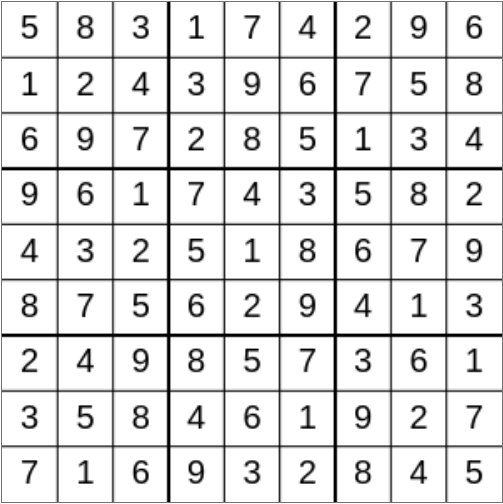
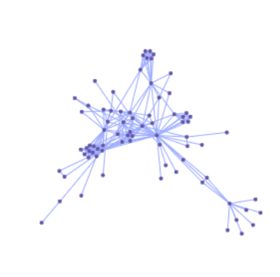

## all projects:
this is where i keep all my projects! 

----
  
[tic-tac-toe](posts/tic-tac-toe): play tic-tac-toe against a perfect bot  

----  
  
[k-means image clustering](posts/k-means): use only k colours to colourise an image  

----  
  
[2048](posts/2048): an implementation of the classic 2048 game   

----  
  
[maze creation](posts/maze): see how mazes are generated!  

----  
  
[floodfill](posts/floodfill): watch some pretty colours fill up a maze  

----  
  
[sudoku solver](posts/sudoku): a brute-force solution to any sudoku grid  

----   
  
[network visualisation](posts/network-visualisation): see how computers visualise complex networks

----  